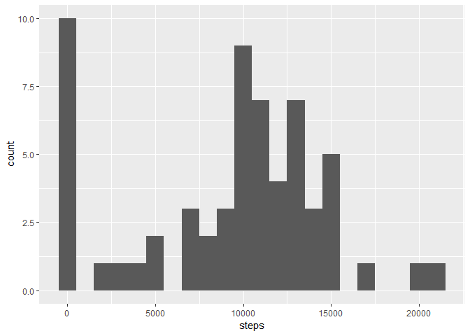
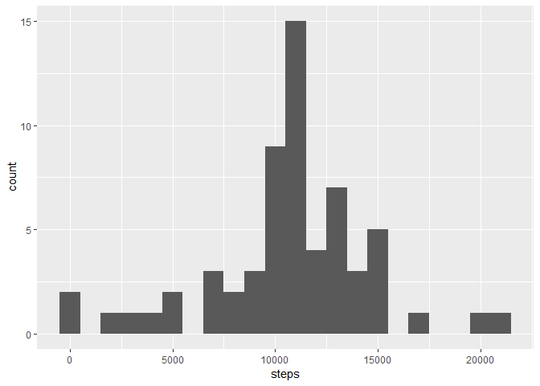
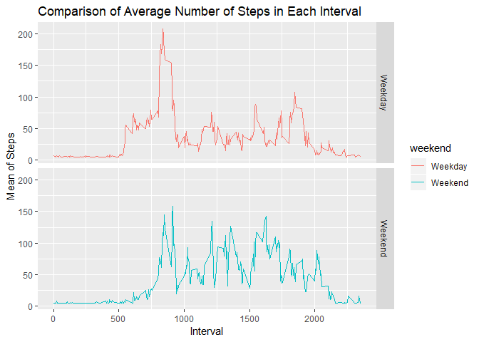

## Loading and preprocessing the data


```r
unzip("activity.zip")
activity <- read_csv("activity.csv")
activity$date <- ymd(activity$date)
```


## What is mean total number of steps taken per day?


```r
# total steps
total.steps <- activity %>% group_by(date) %>% summarise(steps = sum(steps,na.rm = TRUE))

#histogram
ggplot(total.steps, aes(x=steps)) +
  geom_histogram(binwidth=1000)
```

<!-- -->

### mean


```r
# mean
mean(total.steps$steps,na.rm = TRUE)
```

```
## [1] 9354.23
```


### median


```r
# median
median(total.steps$steps, na.rm = TRUE)
```

```
## [1] 10395
```


## What is the average daily activity pattern?


```r
interval_avg <- activity %>%
  group_by(interval) %>%
  summarise(mean = mean(steps,na.rm = TRUE))

ggplot(interval_avg, aes(x = interval, y = mean))+
geom_line()+
xlab("5-minute interval") +
ylab("average number of steps taken")
```

<!-- -->

```r
# interval with the maximum number of steps
interval_avg %>% filter(mean == max(mean))
```

```
## # A tibble: 1 x 2
##   interval  mean
##      <int> <dbl>
## 1      835  206.
```


## Imputing missing values


```r
sum(is.na(activity$steps))
```

```
## [1] 2304
```

```r
NA.row <-is.na(activity$steps)

activity2 <- activity
activity2$avg <- mean(activity2$steps, na.rm = TRUE)

activity2$steps[NA.row] <- activity2$avg[NA.row]
```

## mean


```r
mean(activity2$steps)
```

```
## [1] 37.3826
```

## median


```r
median(activity2$steps)
```

```
## [1] 0
```

## Histogram


```r
#means <- activity %>% group_by(date) %>% summarise(mean= mean(steps, na.rm = TRUE))

#activity$means <- means$mean[match(activity$date, means$date)]

#activity$steps[NA.row] <- activity$means[NA.row]


# total steps
total.steps2 <- activity2 %>% group_by(date) %>% summarise(steps = sum(steps,na.rm = TRUE))

#histogram
ggplot(total.steps2, aes(x=steps)) +
  geom_histogram(binwidth=1000)
```

<!-- -->

## Observiation

The mean value have increased (37.3826), and it become equal to the 3rd quartile. 
Using the mean seems to be not the best strategy  to impute the missing data since the missing values not normally distributed (missing data are specific to certain days)

# Are there differences in activity patterns between weekdays and weekends?


```r
activity2$date <- as.Date(activity2$date)
activity2$weekday <- weekdays(activity2$date)
activity2$weekend <- ifelse(activity2$weekday=="Saturday" | activity2$weekday=="Sunday", "Weekend", "Weekday" )


activity2weekendweekday <- aggregate(activity2$steps , by= list(activity2$weekend, activity2$interval), na.omit(mean))
names(activity2weekendweekday) <- c("weekend", "interval", "steps")

ggplot(activity2weekendweekday, aes(x=interval, y=steps, color=weekend)) + geom_line()+
facet_grid(weekend ~.) + xlab("Interval") + ylab("Mean of Steps") +
    ggtitle("Comparison of Average Number of Steps in Each Interval")
```

<!-- -->
